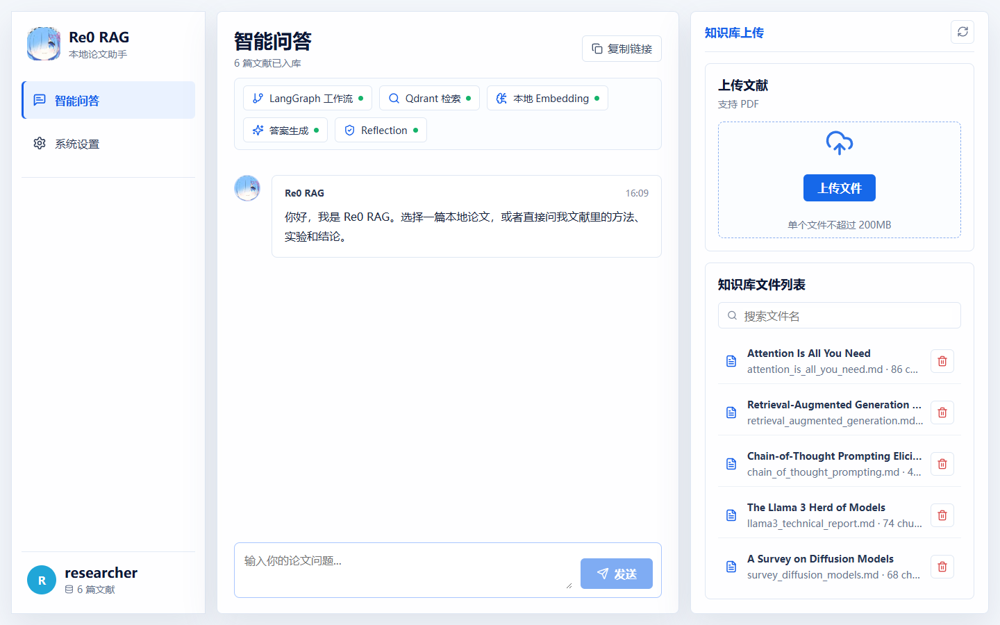
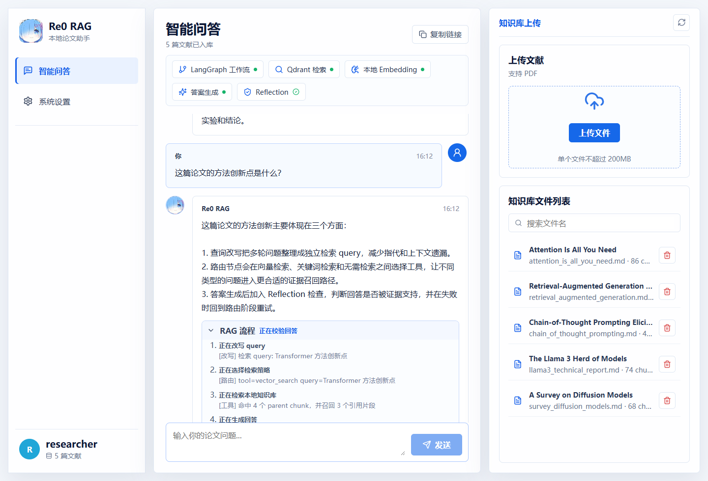
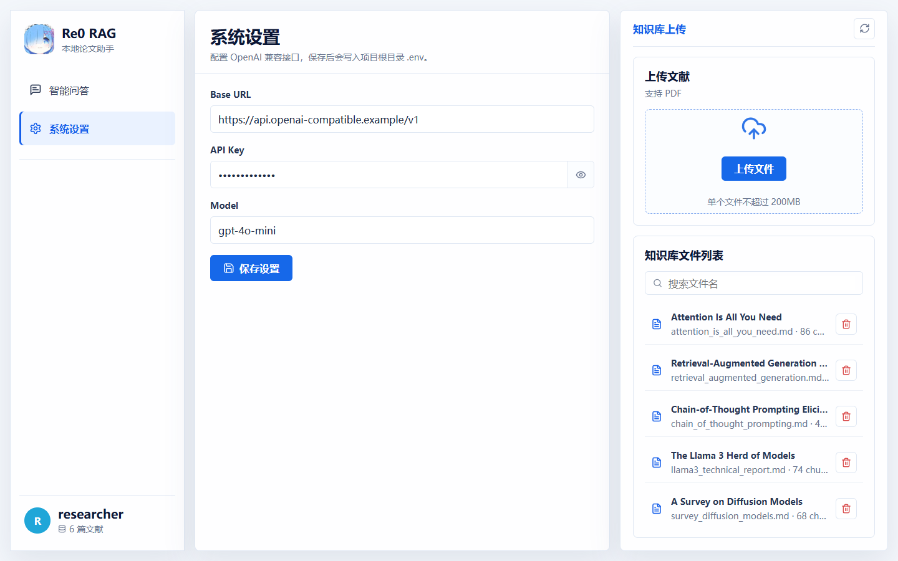
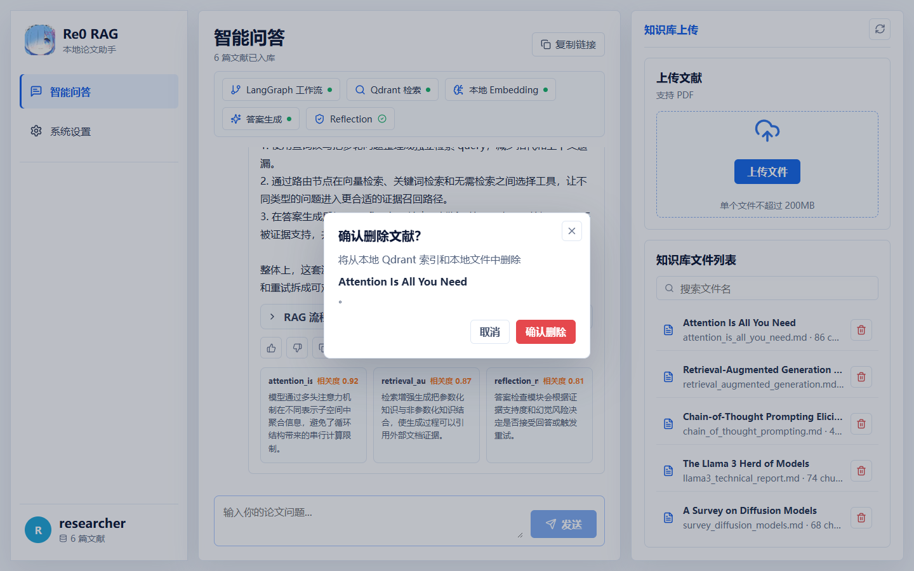

# re0-rag

从零开始的rag生活之本地论文文献知识库 Agentic RAG 项目。

re0-rag 可以把 PDF 论文导入成本地可检索知识库：先将 PDF 转换为 Markdown，再抽取论文元数据、识别表格、切分 parent/child chunks、生成本地 dense embedding，并写入本地 Qdrant 稠密向量库、独立 BM25 稀疏索引和 Neo4j 文献索引图谱。问答阶段使用 LangGraph 组织 Agentic RAG 流程，让系统自动完成查询改写、工具路由、候选召回、BCE cross-encoder 精排、图谱增强、答案生成、答案检查和失败重试。

项目重点是把 RAG 的完整工程链路拆开实现，而不是只调用一个封装好的问答接口。该项目把关键词检索和向量检索作为tools交给llm自行调用，并通过一个Reflection节点判断llm生成回答是否产生幻觉/合理回答问题来提高rag系统回答准确率。它适合用来学习本地知识库、论文问答、LangGraph 工作流、向量检索和 Agentic RAG 的基本实现方式。

## 项目展示

### Web 智能问答



### 问答结果与 RAG 流程



### 系统设置



### 删除确认



### Agentic RAG 内部流程

下面的结构图描述 `re0rag.graph` 的执行链路：模型会自主选择向量检索、BM25 关键词检索或不检索；前两者均经过 Qdrant 初筛和 BCE Rerank 精排，并可按 `use_graph` 条件追加 Neo4j 文献图谱证据。


## 功能特性

- 本地论文入库：`PDF -> Markdown -> 元数据 -> 表格/chunks -> Qdrant + Neo4j 文献索引图谱`
- 支持单篇 PDF 导入，也支持批量导入目录下的 PDF 文件
- 非 PDF 文件和子目录会在批量导入时自动跳过
- 基于 LangGraph 的 Agentic RAG 流程：`summarize_memory -> rewrite -> route -> recall -> BCE rerank -> optional graph retrieval -> answer -> judge -> retry`
- 支持多轮对话，交互模式下会保留同一会话的历史上下文；长对话超过阈值后会把早期消息压缩为摘要
- 支持本地向量检索和基于 Qdrant BM25 sparse vectors 的关键词检索；两路检索均会先召回 12 个 child chunks，再用本地 BCE cross-encoder 精排为 4 个，并可按需追加文献图谱检索
- 文献索引图谱只保存标题、作者、年份、期刊/会议、领域和关键词等书目信息，不抽取论文正文中的实体和论断
- 支持表格感知检索，表格会单独保存、向量化、写入 BM25 稀疏索引，并作为 evidence 参与回答
- 支持可选 OCR/多模态表格增强：Markdown 表格抽取不完整时，可调用 PaddleOCR-VL 补充结构化表格
- 导入阶段会抽取论文标题、作者、年份、期刊/会议、领域、关键词和摘要等元数据
- 使用本地 Qdrant 持久化稠密向量库和 BM25 稀疏索引，不依赖云端向量数据库
- 使用 HuggingFace sentence-transformers 生成本地 embedding
- 使用 OpenAI 兼容 Chat Completions 接口，可接 OpenAI、兼容网关或本地兼容服务
- 默认问答只输出最终答案，`-t`/`--trace` 可查看完整 Agentic RAG 运行过程

## 检索工具

re0-rag 在问答阶段会根据问题自动选择工具：

- `vector_search`：适合语义解释、机制总结、方法比较、结论归纳等问题
- `keyword_search`：使用独立的 Qdrant BM25 sparse collection，适合论文标题、模型名、数据集、指标名、表格编号等精确匹配问题
- `no_retrieval`：适合不需要查询论文库的寒暄、系统操作或普通改写类问题

检索工具会对正文 child chunks 执行二阶段排序：向量检索以本地 embedding 查询 Qdrant，关键词检索以 BM25 sparse vectors 查询 Qdrant；两者都会先召回 12 个候选，再由本地 `maidalun1020/bce-reranker-base_v1` 逐对计算 query 与片段的相关性，精排并保留前 4 个，随后回填 parent 章节和关联表格作为回答证据。Web 流程条与 CLI trace 会展示“初筛 → BCE Rerank 精排”这一步。

精排默认开启。模型首次下载时优先使用 Hugging Face 官方站；官方请求失败才自动尝试镜像。可通过 `RE0RAG_RERANK_ENABLED=0` 关闭精排，或用 `RE0RAG_HF_MIRROR_ENDPOINT` 修改镜像地址。

图谱检索不是第四个互斥选项。路由器先选择一个主检索工具，再通过 `use_graph` 开关决定是否追加图谱证据。涉及作者、年份、期刊/会议、领域、相关论文和论文间关系的问题通常使用“向量或关键词主检索 + 图谱增强”；普通论文内容问题只执行主检索。

当前作者消歧采用姓名大小写、空白和标点归一化后的精确合并，尚未使用 ORCID、机构或邮箱处理同名作者；领域使用抽取结果和内置宽粒度别名表归一化。个人论文库通常足够使用，但涉及大量同名作者时应把 ORCID/机构加入后续版本。

如果答案检查没有通过，系统会根据失败原因重新路由，并在允许次数内再次检索和生成。

## 项目结构

```text
re0-rag/
├── main.py                    # Web / CLI 统一入口
├── config.py                  # 路径、模型、检索参数、Prompt 与 LLM 配置
├── requirements.txt           # Python 依赖
├── README.md                  # 项目说明
├── LICENSE                    # MIT License
├── assets/                    # README 展示图片
│   ├── architecture.png       # Agentic RAG 内部流程
│   ├── architecture.svg       # 可编辑的 Agentic RAG 流程图源文件
│   ├── web-chat.png           # Web 智能问答界面
│   ├── web-answer.png         # 问答结果与 RAG 流程
│   ├── web-settings.png       # 系统设置界面
│   └── web-delete-confirm.png # 删除确认界面
├── re0rag/                    # Agentic RAG 运行时
│   ├── graph.py               # LangGraph 构建、预加载与运行入口
│   ├── nodes.py               # input/summarize_memory/rewrite/route/tool/llm/judge/output 节点
│   ├── edges.py               # LangGraph 边与 judge 条件路由
│   ├── state.py               # RAGState 状态定义
│   ├── tools.py               # 本地检索工具
│   └── utils.py               # Prompt、证据格式化、JSON 解析等工具
├── db/                        # 入库、切分、向量化、元数据与 Qdrant 管理
│   ├── loader.py              # PDF -> Markdown
│   ├── meta.py                # 论文元数据抽取
│   ├── chunk.py               # 表格抽取与 parent/child chunk 切分
│   ├── ocr.py                 # 可选 OCR/多模态表格增强
│   ├── embedding.py           # HuggingFace embedding 模型
│   ├── manager.py             # Qdrant 写入、删除、列表、检索
│   ├── literature_graph.py    # Neo4j 文献索引图谱构建、删除与关系检索
│   ├── chunks/                # 本地 chunks 运行产物，仅保留 .gitkeep
│   ├── meta/                  # 本地元数据运行产物，仅保留 .gitkeep
│   ├── ocr/                   # OCR Markdown 缓存运行产物，仅保留 .gitkeep
│   └── vector/                # 本地 Qdrant 数据，仅保留 .gitkeep
├── docs/                      # PDF 转换后的 Markdown，仅保留 .gitkeep
├── model/
│   └── embedding/             # embedding 模型缓存，仅保留 .gitkeep
├── api/
│   └── server.py              # FastAPI Web API
├── cli/
│   └── cli.py                 # CLI 命令实现
└── web/                       # Vite + React 前端
```

## 环境要求

- Python 3.10+
- 一个 OpenAI 兼容 Chat Completions 接口
- 本地磁盘空间，用于保存 Markdown、chunks、Qdrant 数据和 embedding 模型缓存

建议使用虚拟环境：

```bash
python -m venv .venv
```

Linux/macOS:

```bash
source .venv/bin/activate
```

Windows PowerShell:

```powershell
.\.venv\Scripts\Activate.ps1
```

安装依赖：

```bash
pip install -r requirements.txt
```


## 配置

在项目根目录创建 `.env` 文件：

```text
RE0RAG_LLM_BASE_URL=https://your-openai-compatible-endpoint/v1
RE0RAG_LLM_API_KEY=your-api-key
RE0RAG_LLM_MODEL=your-model-name

# 可选：关闭 BCE cross-encoder 精排（默认开启）
RE0RAG_RERANK_ENABLED=1
# 可选：精排模型下载失败时使用的 Hugging Face 镜像
RE0RAG_HF_MIRROR_ENDPOINT=https://hf-mirror.com
```

`RE0RAG_LLM_BASE_URL` 填到 `/v1` 即可，不要追加 `/chat/completions`。LangChain 会自动拼接接口路径。

文献图谱使用 Neo4j。配置完成后，导入与检索会自动启用；Neo4j 服务、驱动或连接配置不可用时，系统会自动关闭图谱增强，向量与关键词检索仍可正常运行：

```text
RE0RAG_GRAPH_ENABLED=1
RE0RAG_GRAPH_BACKEND=neo4j
RE0RAG_NEO4J_URI=bolt://localhost:7687
RE0RAG_NEO4J_USERNAME=neo4j
RE0RAG_NEO4J_PASSWORD=your-password
RE0RAG_NEO4J_DATABASE=neo4j
RE0RAG_NEO4J_NAMESPACE=re0rag
```

需要完全关闭图谱功能时设置 `RE0RAG_GRAPH_ENABLED=0`。同一 Neo4j 实例中的项目数据使用 `Re0Rag` 标签和 `namespace` 隔离，`reindex-graph` 只会重建当前命名空间的数据。

如果需要增强复杂 PDF 表格抽取，可以继续配置 OCR/多模态表格服务：

```text
RE0RAG_OCR_ENABLED=1
RE0RAG_OCR_BASE_URL=https://paddleocr.aistudio-app.com/api/v2/ocr/jobs
RE0RAG_OCR_API_KEY=your-ocr-token
RE0RAG_OCR_MODEL=PaddleOCR-VL-1.6
RE0RAG_OCR_TIMEOUT_SECONDS=900
```

OCR 是可选增强。未配置、服务不可用或任务失败时，导入流程不会中断；系统会保留普通 Markdown 表格抽取结果，并在导入日志中提示跳过 OCR 表格增强。OCR 成功时，结果会缓存到 `db/ocr/{paper_stem}/`，后续重复导入默认复用缓存。

也可以使用下面这组多模态别名，`RE0RAG_OCR_*` 未配置时会自动 fallback：

```text
RE0RAG_MULTIMODAL_BASE_URL=https://paddleocr.aistudio-app.com/api/v2/ocr/jobs
RE0RAG_MULTIMODAL_API_KEY=your-ocr-token
RE0RAG_MULTIMODAL_MODEL=PaddleOCR-VL-1.6
```

项目也兼容下面这组三个环境变量：

```text
LLM_BASE_URL=https://your-openai-compatible-endpoint/v1
LLM_API_KEY=your-api-key
LLM_MODEL=your-model-name
```

其他参数集中在 [config.py](./config.py)，包括：

- chunk 大小与 overlap
- parent/child chunk 切分参数
- 检索 top-k
- Agent 最大重试次数
- embedding 模型名称与缓存目录
- BCE reranker 模型、初筛数量与精排保留数量
- Qdrant 稠密向量 collection、BM25 稀疏 collection 名称
- 查询改写、路由、回答生成和答案检查 Prompt

## 快速开始

启动 Web：

```bash
pip install -r requirements.txt
cd web && npm install
cd ..
python main.py
```

API 默认运行在 `http://127.0.0.1:8000`，前端默认运行在 `http://127.0.0.1:5173`。

查看已入库论文：

```bash
python main.py -cli list
```

导入单篇论文：

```bash
python main.py -cli import "your-paper.pdf"
```

批量导入目录下的 PDF：

```bash
python main.py -cli import "path/to/papers"
```

目录导入只处理该目录第一层的 PDF 文件，遇到非 PDF 文件或子目录会跳过。重复导入同名论文时，会先删除旧索引，再写入新索引。

如果是在升级到 BM25 稀疏检索前已经导入过论文，需要从已有 chunks 补建一次关键词索引：

```bash
python main.py -cli reindex-keywords
```

新导入的论文会在 `import` 阶段自动写入 BM25 稀疏索引，提问时不会重新构建索引。

如果是在加入文献索引图谱前已经导入过论文，可从已有 `db/meta` 元数据重建图谱，无需重新切分或向量化：

```bash
python main.py -cli reindex-graph
```

提问：

```bash
python main.py -cli query "这篇论文解决了什么问题？"
```

也可以直接把问题作为参数：

```bash
python main.py -cli "这篇论文解决了什么问题？"
```

启动交互式问答：

```bash
python main.py -cli
```

默认问答只输出最终答案。如果想查看完整 Agentic RAG 流程（包括 Qdrant/BM25 初筛、BCE Rerank 精排和可选图谱增强），使用 trace 模式：

```bash
python main.py -t
python main.py -t "RepMobile 的结构重参数化是怎么做的？"
python main.py -cli query -t "RepMobile 的结构重参数化是怎么做的？"
```

删除已入库论文：

```bash
python main.py -cli delete "your-paper.md"
```

`delete` 使用的 source 名称可以通过 `python main.py -cli list` 查看。

## 工作流程

### 入库阶段

1. `db.loader` 使用 `pymupdf4llm` 将 PDF 转为 Markdown。
2. `db.meta` 调用配置好的 LLM，从 Markdown 与 PDF 前几页文本中抽取标题、作者、年份、期刊/会议、领域、关键词和摘要。
3. `db.chunk` 抽取 Markdown 表格，并在配置 OCR 时调用 `db.ocr` 用 PaddleOCR-VL 补充复杂表格；表格记录会保留 `content`、`markdown`、`cells`、`source_method`、`confidence` 等字段。
4. `db.embedding` 使用 `all-MiniLM-L6-v2` 生成 child chunks 和 table evidence 的 embedding。
5. `db.manager` 将 child chunks 与 tables 写入本地 Qdrant：dense embeddings 写入 `re0rag_docs`，BM25 sparse vectors 写入 `re0rag_docs_bm25`；parents 只落盘，用于命中 child 后回填更完整上下文。
6. `db.literature_graph` 将元数据写入 Neo4j 属性图，建立 Paper 与 Author、Year、Venue、Field、Keyword 节点之间的边，并从论文关系派生带权重的 `Author -> WORKS_ON -> Field` 边。

### 问答阶段

LangGraph 运行流程如下：

```text
input
  -> summarize_memory
  -> rewrite_query
  -> route
  -> tool（Qdrant/BM25 初筛 -> BCE Rerank 精排 -> parent/table 回填）
  -> graph_retrieval（按需增强）
  -> llm
  -> judge
      -> output，答案通过或重试耗尽
      -> route，答案未通过且仍可重试
```

各节点职责：

- `input`：接收用户问题，并写入多轮对话历史
- `summarize_memory`：当同一会话消息超过阈值时，将早期消息压缩进长期摘要并删除旧消息
- `rewrite_query`：结合长期摘要和最近对话，把当前问题改写为独立检索 query
- `route`：选择 `vector_search`、`keyword_search` 或 `no_retrieval` 作为主检索，并设置 `use_graph`
- `tool`：执行向量或 BM25 主检索；正文 child chunks 先初筛，再经本地 BCE cross-encoder 精排，随后回填 parent 章节与关联表格，返回 evidence、documents 和 sources
- `graph_retrieval`：当 `use_graph=true` 时检索书目关系，追加论文元数据和可解释路径
- `llm`：基于证据生成回答
- `judge`：检查答案是否回答问题、是否被证据支持、是否有幻觉
- `output`：输出最终答案和来源

## CLI 命令

```bash
python main.py
python main.py -cli import <PDF path or directory path>
python main.py -cli reindex-keywords
python main.py -cli reindex-graph
python main.py -cli delete <source.md>
python main.py -cli list
python main.py -cli query <question>
python main.py -cli query -t <question>
python main.py -t [question]
python main.py -cli <question>
python main.py -cli
```

其中 `query` 和交互式问答默认使用“初筛 → BCE Rerank 精排”的两阶段检索。设置 `RE0RAG_RERANK_ENABLED=0` 后会跳过精排，并按原始检索顺序保留结果。

## 本地运行产物

以下内容是本地运行产物或个人开发文件，默认不上传 GitHub：

- `.env`
- PDF 原文
- `docs/` 中转换后的 Markdown
- `db/chunks/` 中切分后的 chunks JSON
- `db/meta/` 中抽取后的 metadata JSON
- `db/vector/` 中的 Qdrant 本地数据
- `model/embedding/` 中的 embedding 模型缓存
- `model/reranker/` 中的 BCE reranker 模型缓存
- `script/`、`tests/` 等个人实验脚本

这些目录可以通过 `.gitkeep` 保留空目录结构，但不提交实际运行数据。


## License

MIT License. See [LICENSE](./LICENSE).
