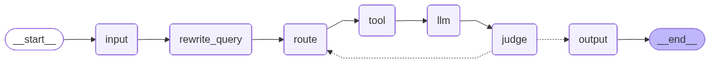

# re0-rag

从零实现的本地论文文献知识库 Agentic RAG 项目。

re0-rag 可以把 PDF 论文导入成本地可检索知识库：PDF 先转换为 Markdown，再抽取论文元数据、识别表格、切分 parent/child chunks、生成本地 embedding，最后写入本地 Qdrant 向量库。问答阶段使用 LangGraph 组织 Agentic RAG 流程，让系统自动完成查询改写、工具路由、证据检索、答案生成、答案检查和失败重试。



## 功能特性

- 本地论文入库：`PDF -> Markdown -> 元数据 -> 表格 -> parent/child chunks -> embeddings -> Qdrant`
- 支持单篇 PDF 导入，也支持导入目录下所有 PDF，非 PDF 文件会自动跳过
- 基于 LangGraph 的 Agentic RAG 流程：`rewrite -> route -> tool -> answer -> judge -> retry`
- 本地检索工具：
  - `vector_search`：适合语义解释、机制总结、方法比较
  - `keyword_search`：适合论文标题、模型名、数据集、指标、表格编号等精确匹配
  - `no_retrieval`：适合不需要查询论文库的问题
- 表格感知检索：表格会单独保存和向量化，并在回答时作为 evidence 使用
- 元数据抽取：导入时从论文中抽取标题、作者、期刊/会议、摘要
- OpenAI 兼容 LLM 接口：可接 OpenAI、兼容网关或本地兼容服务
- 默认问答只输出最终答案，`-t` 可查看完整 trace 流程

## 项目结构

```text
re0-rag/
├── main.py                    # CLI 主入口
├── config.py                  # 路径、模型、检索参数、Prompt 与 LLM 配置
├── requirements.txt           # Python 依赖
├── langgraph_native_graph.png # LangGraph 横向架构图
├── re0rag/                    # Agentic RAG 运行时
│   ├── graph.py               # LangGraph 构建、预加载与运行入口
│   ├── nodes.py               # input/rewrite/route/tool/llm/judge/output 节点
│   ├── edges.py               # LangGraph 边与 judge 条件路由
│   ├── state.py               # RAGState 状态定义
│   ├── tools.py               # 本地检索工具
│   └── utils.py               # Prompt、证据格式化、JSON 解析等工具
├── db/                        # 入库、切分、向量化、元数据与 Qdrant 管理
│   ├── loader.py              # PDF -> Markdown
│   ├── meta.py                # 论文元数据抽取
│   ├── chunk.py               # 表格抽取与 parent/child chunk 切分
│   ├── embedding.py           # HuggingFace embedding 模型
│   └── manager.py             # Qdrant 写入、删除、列表、检索
└── ui/
    └── cli.py                 # CLI 命令实现
```

以下内容是本地运行产物或个人开发文件，默认不上传 GitHub：

- `.env`
- `docs/`
- `db/chunks/`
- `db/meta/`
- `db/vector/`
- `model/embedding/`
- `script/`
- `test/`
- `*.pdf`

## 环境要求

- Python 3.10+
- 一个 OpenAI 兼容 Chat Completions 接口
- 本地磁盘空间，用于 embedding 模型缓存、Markdown、chunks 和 Qdrant 数据

安装依赖：

```bash
pip install -r requirements.txt
```

## 配置

复制环境变量模板：

```bash
cp .env.example .env
```

Windows PowerShell：

```powershell
Copy-Item .env.example .env
```

然后填写：

```text
RE0RAG_LLM_BASE_URL=https://your-openai-compatible-endpoint/v1
RE0RAG_LLM_API_KEY=your-api-key
RE0RAG_LLM_MODEL=your-model-name
```

`RE0RAG_LLM_BASE_URL` 填到 `/v1` 即可，不要追加 `/chat/completions`。LangChain 会自动拼接接口路径。

项目也兼容 `LLM_BASE_URL`、`LLM_API_KEY`、`LLM_MODEL` 这组三个环境变量。其他参数集中在 [config.py](./config.py)，包括 chunk 大小、检索 top-k、重试次数、embedding 模型、Qdrant collection 名称和 Prompt 模板。

## 快速开始

查看已入库论文：

```bash
python main.py list
```

导入单篇论文：

```bash
python main.py import "your-paper.pdf"
```

批量导入目录下的 PDF：

```bash
python main.py import "path/to/papers"
```

目录导入只处理该目录第一层的 PDF 文件，遇到非 PDF 文件或子目录会跳过。重复导入同名论文时，会先删除旧索引，再写入新索引。

提问：

```bash
python main.py query "这篇论文解决了什么问题？"
```

或者直接把问题作为参数：

```bash
python main.py "这篇论文解决了什么问题？"
```

启动交互式问答：

```bash
python main.py
```

默认问答只输出最终答案。如果想查看完整 Agentic RAG 流程，使用 trace 模式：

```bash
python main.py -t
python main.py -t "RepMobile 的结构重参数化是怎么做的？"
python main.py query -t "RepMobile 的结构重参数化是怎么做的？"
```

删除已入库论文：

```bash
python main.py delete "your-paper.md"
```

`delete` 使用的 source 名称可以通过 `python main.py list` 查看。

## 工作流程

### 入库阶段

1. `db.loader` 使用 `pymupdf4llm` 将 PDF 转为 Markdown。
2. `db.meta` 调用配置好的 LLM，从 Markdown 与 PDF 前几页文本中抽取标题、作者、期刊/会议和摘要。
3. `db.chunk` 抽取表格，并把正文切成 parent chunks 与 child chunks。
4. `db.embedding` 使用 `all-MiniLM-L6-v2` 生成 child chunks 和 table evidence 的 embedding。
5. `db.manager` 将 child chunks 与 tables 写入本地 Qdrant；parents 只落盘，用于命中 child 后回填更完整上下文。

### 问答阶段

LangGraph 运行流程如下：

```text
input
  -> rewrite_query
  -> route
  -> tool
  -> llm
  -> judge
      -> output，答案通过或重试耗尽
      -> route，答案未通过且仍可重试
```

各节点职责：

- `input`：接收用户问题，并写入多轮对话历史
- `rewrite_query`：结合历史对话，把当前问题改写为独立检索 query
- `route`：选择 `vector_search`、`keyword_search` 或 `no_retrieval`
- `tool`：执行本地检索工具，返回 evidence、documents 和 sources
- `llm`：基于证据生成回答
- `judge`：检查答案是否回答问题、是否被证据支持、是否有幻觉
- `output`：输出最终答案和来源

## CLI 命令

```bash
python main.py import <PDF path or directory path>
python main.py delete <source.md>
python main.py list
python main.py query <question>
python main.py query -t <question>
python main.py -t [question]
python main.py <question>
python main.py
```

## GitHub 发布注意事项

发布前请确认：

- 不上传 `.env`、API Key 或任何私密配置
- 不上传 PDF 原文、转换后的 Markdown、chunks、metadata、Qdrant 数据和 embedding 模型缓存
- 不上传个人测试脚本和实验输出
- `.env.example` 只保留占位值
- README 中的架构图可以正常显示

## License

MIT License. See [LICENSE](./LICENSE).
