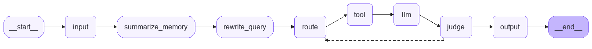
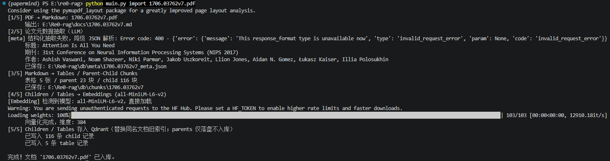
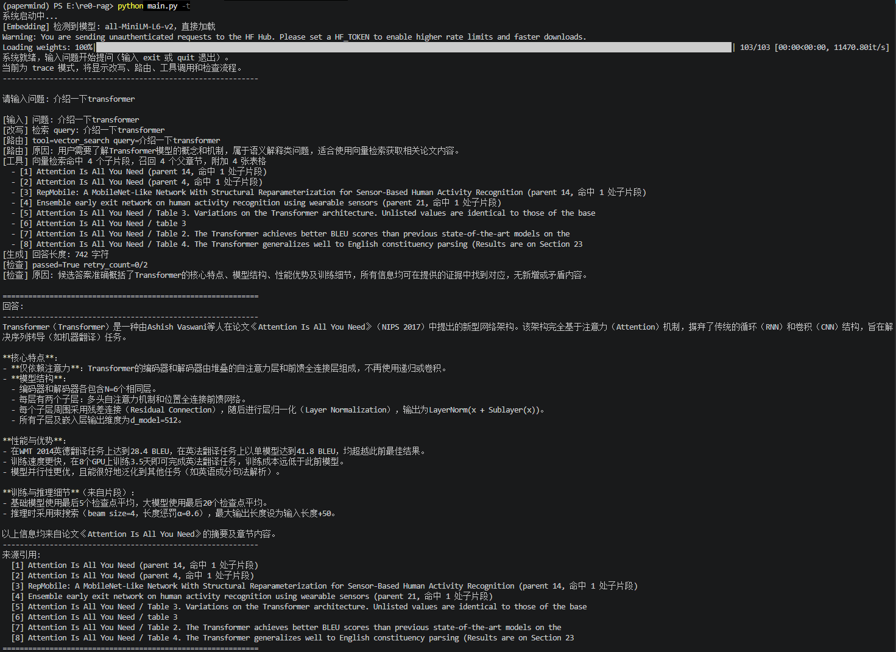

# re0-rag

从零开始的rag生活之本地论文文献知识库 Agentic RAG 项目。

re0-rag 可以把 PDF 论文导入成本地可检索知识库：先将 PDF 转换为 Markdown，再抽取论文元数据、识别表格、切分 parent/child chunks、生成本地 dense embedding，并写入本地 Qdrant 稠密向量库与独立 BM25 稀疏索引。问答阶段使用 LangGraph 组织 Agentic RAG 流程，让系统自动完成查询改写、工具路由、证据检索、答案生成、答案检查和失败重试。

项目重点是把 RAG 的完整工程链路拆开实现，而不是只调用一个封装好的问答接口。该项目把关键词检索和向量检索作为tools交给llm自行调用，并通过一个Reflection节点判断llm生成回答是否产生幻觉/合理回答问题来提高rag系统回答准确率。它适合用来学习本地知识库、论文问答、LangGraph 工作流、向量检索和 Agentic RAG 的基本实现方式。

## 项目展示

### Agentic RAG 流程



### 导入文档



### 回答问题



## 功能特性

- 本地论文入库：`PDF -> Markdown -> 元数据 -> 表格 -> parent/child chunks -> dense embeddings + BM25 sparse vectors -> Qdrant`
- 支持单篇 PDF 导入，也支持批量导入目录下的 PDF 文件
- 非 PDF 文件和子目录会在批量导入时自动跳过
- 基于 LangGraph 的 Agentic RAG 流程：`rewrite -> route -> tool -> answer -> judge -> retry`
- 支持多轮对话，交互模式下会保留同一会话的历史上下文
- 支持本地向量检索和基于 Qdrant BM25 sparse vectors 的关键词检索两类工具
- 支持表格感知检索，表格会单独保存、向量化、写入 BM25 稀疏索引，并作为 evidence 参与回答
- 导入阶段会抽取论文标题、作者、期刊/会议和摘要等元数据
- 使用本地 Qdrant 持久化稠密向量库和 BM25 稀疏索引，不依赖云端向量数据库
- 使用 HuggingFace sentence-transformers 生成本地 embedding
- 使用 OpenAI 兼容 Chat Completions 接口，可接 OpenAI、兼容网关或本地兼容服务
- 默认问答只输出最终答案，`-t`/`--trace` 可查看完整 Agentic RAG 运行过程

## 检索工具

re0-rag 在问答阶段会根据问题自动选择工具：

- `vector_search`：适合语义解释、机制总结、方法比较、结论归纳等问题
- `keyword_search`：使用独立的 Qdrant BM25 sparse collection，适合论文标题、模型名、数据集、指标名、表格编号等精确匹配问题
- `no_retrieval`：适合不需要查询论文库的寒暄、系统操作或普通改写类问题

如果答案检查没有通过，系统会根据失败原因重新路由，并在允许次数内再次检索和生成。

## 项目结构

```text
re0-rag/
├── main.py                    # CLI 主入口
├── config.py                  # 路径、模型、检索参数、Prompt 与 LLM 配置
├── requirements.txt           # Python 依赖
├── README.md                  # 项目说明
├── LICENSE                    # MIT License
├── assets/                    # README 展示图片
│   ├── architecture.png       # Agentic RAG 结构流程
│   ├── import.png             # 导入文档界面
│   └── answer.png             # 回答问题界面
├── re0rag/                    # Agentic RAG 运行时
│   ├── graph.py               # LangGraph 构建、预加载与运行入口
│   ├── nodes.py               # input/rewrite/route/tool/llm/judge/output 节点
│   ├── edges.py               # LangGraph 边与 judge 条件路由
│   ├── state.py               # RAGState 状态定义
│   ├── tools.py               # 本地检索工具
│   └── utils.py               # Prompt、证据格式化、JSON 解析等工具
├── db/                        # 入库、切分、向量化、元数据与 Qdrant 管理
│   ├── loader.py              # PDF -> Markdown
│   ├── meta.py                # 论文元数据抽取
│   ├── chunk.py               # 表格抽取与 parent/child chunk 切分
│   ├── embedding.py           # HuggingFace embedding 模型
│   ├── manager.py             # Qdrant 写入、删除、列表、检索
│   ├── chunks/                # 本地 chunks 运行产物，仅保留 .gitkeep
│   ├── meta/                  # 本地元数据运行产物，仅保留 .gitkeep
│   └── vector/                # 本地 Qdrant 数据，仅保留 .gitkeep
├── docs/                      # PDF 转换后的 Markdown，仅保留 .gitkeep
├── model/
│   └── embedding/             # embedding 模型缓存，仅保留 .gitkeep
└── ui/
    └── cli.py                 # CLI 命令实现
```

## 环境要求

- Python 3.10+
- 一个 OpenAI 兼容 Chat Completions 接口
- 本地磁盘空间，用于保存 Markdown、chunks、Qdrant 数据和 embedding 模型缓存

建议使用虚拟环境：

```bash
python -m venv .venv
```

Linux/macOS:

```bash
source .venv/bin/activate
```

Windows PowerShell:

```powershell
.\.venv\Scripts\Activate.ps1
```

安装依赖：

```bash
pip install -r requirements.txt
```


## 配置

在项目根目录创建 `.env` 文件：

```text
RE0RAG_LLM_BASE_URL=https://your-openai-compatible-endpoint/v1
RE0RAG_LLM_API_KEY=your-api-key
RE0RAG_LLM_MODEL=your-model-name
```

`RE0RAG_LLM_BASE_URL` 填到 `/v1` 即可，不要追加 `/chat/completions`。LangChain 会自动拼接接口路径。

项目也兼容下面这组三个环境变量：

```text
LLM_BASE_URL=https://your-openai-compatible-endpoint/v1
LLM_API_KEY=your-api-key
LLM_MODEL=your-model-name
```

其他参数集中在 [config.py](./config.py)，包括：

- chunk 大小与 overlap
- parent/child chunk 切分参数
- 检索 top-k
- Agent 最大重试次数
- embedding 模型名称与缓存目录
- Qdrant 稠密向量 collection、BM25 稀疏 collection 名称
- 查询改写、路由、回答生成和答案检查 Prompt

## 快速开始

查看已入库论文：

```bash
python main.py list
```

导入单篇论文：

```bash
python main.py import "your-paper.pdf"
```

批量导入目录下的 PDF：

```bash
python main.py import "path/to/papers"
```

目录导入只处理该目录第一层的 PDF 文件，遇到非 PDF 文件或子目录会跳过。重复导入同名论文时，会先删除旧索引，再写入新索引。

如果是在升级到 BM25 稀疏检索前已经导入过论文，需要从已有 chunks 补建一次关键词索引：

```bash
python main.py reindex-keywords
```

新导入的论文会在 `import` 阶段自动写入 BM25 稀疏索引，提问时不会重新构建索引。

提问：

```bash
python main.py query "这篇论文解决了什么问题？"
```

也可以直接把问题作为参数：

```bash
python main.py "这篇论文解决了什么问题？"
```

启动交互式问答：

```bash
python main.py
```

默认问答只输出最终答案。如果想查看完整 Agentic RAG 流程，使用 trace 模式：

```bash
python main.py -t
python main.py -t "RepMobile 的结构重参数化是怎么做的？"
python main.py query -t "RepMobile 的结构重参数化是怎么做的？"
```

删除已入库论文：

```bash
python main.py delete "your-paper.md"
```

`delete` 使用的 source 名称可以通过 `python main.py list` 查看。

## 工作流程

### 入库阶段

1. `db.loader` 使用 `pymupdf4llm` 将 PDF 转为 Markdown。
2. `db.meta` 调用配置好的 LLM，从 Markdown 与 PDF 前几页文本中抽取标题、作者、期刊/会议和摘要。
3. `db.chunk` 抽取表格，并把正文切成 parent chunks 与 child chunks。
4. `db.embedding` 使用 `all-MiniLM-L6-v2` 生成 child chunks 和 table evidence 的 embedding。
5. `db.manager` 将 child chunks 与 tables 写入本地 Qdrant：dense embeddings 写入 `re0rag_docs`，BM25 sparse vectors 写入 `re0rag_docs_bm25`；parents 只落盘，用于命中 child 后回填更完整上下文。

### 问答阶段

LangGraph 运行流程如下：

```text
input
  -> rewrite_query
  -> route
  -> tool
  -> llm
  -> judge
      -> output，答案通过或重试耗尽
      -> route，答案未通过且仍可重试
```

各节点职责：

- `input`：接收用户问题，并写入多轮对话历史
- `rewrite_query`：结合历史对话，把当前问题改写为独立检索 query
- `route`：选择 `vector_search`、`keyword_search` 或 `no_retrieval`
- `tool`：执行本地检索工具，返回 evidence、documents 和 sources
- `llm`：基于证据生成回答
- `judge`：检查答案是否回答问题、是否被证据支持、是否有幻觉
- `output`：输出最终答案和来源

## CLI 命令

```bash
python main.py import <PDF path or directory path>
python main.py reindex-keywords
python main.py delete <source.md>
python main.py list
python main.py query <question>
python main.py query -t <question>
python main.py -t [question]
python main.py <question>
python main.py
```

## 本地运行产物

以下内容是本地运行产物或个人开发文件，默认不上传 GitHub：

- `.env`
- PDF 原文
- `docs/` 中转换后的 Markdown
- `db/chunks/` 中切分后的 chunks JSON
- `db/meta/` 中抽取后的 metadata JSON
- `db/vector/` 中的 Qdrant 本地数据
- `model/embedding/` 中的 embedding 模型缓存
- `script/`、`test/` 等个人实验脚本

这些目录可以通过 `.gitkeep` 保留空目录结构，但不提交实际运行数据。


## License

MIT License. See [LICENSE](./LICENSE).
